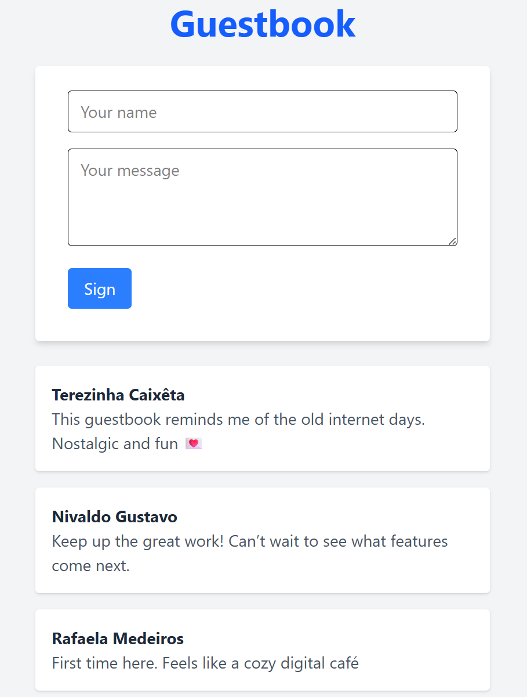

# 📝 Guestbook Project

A fullstack guestbook web application built with **Django REST Framework** and **React**, styled using **Tailwind CSS**. Users can submit messages and view entries in real-time.


## 🚀 Features

- Submit guestbook entries (name + message)
- View all messages instantly
- Responsive and modern UI
- Backend API built with Django REST Framework
- Frontend built with React and Vite
- Styled with Tailwind CSS

## 🧱 Tech Stack

| Layer     | Technology              |
|-----------|--------------------------|
| Frontend  | React, Vite, Tailwind CSS |
| Backend   | Django, Django REST Framework |
| Database  | SQLite (default for dev) |

## 🛠️ Setup Instructions

### Backend (Django)
```bash
cd guestbook-backend
python -m venv venv
venv\Scripts\activate (on Windows)
source venv/bin/activate (on MacOS/Linux)
pip install -r requirements.txt
python manage.py migrate
python manage.py runserver
```

### Frontend (React + Vite)
```bash
cd guestbook-frontend
npm install
npm run dev
```

## 📸 Screenshot


## 💬 Author
Made with ❤️ by Arthur C. Araújo